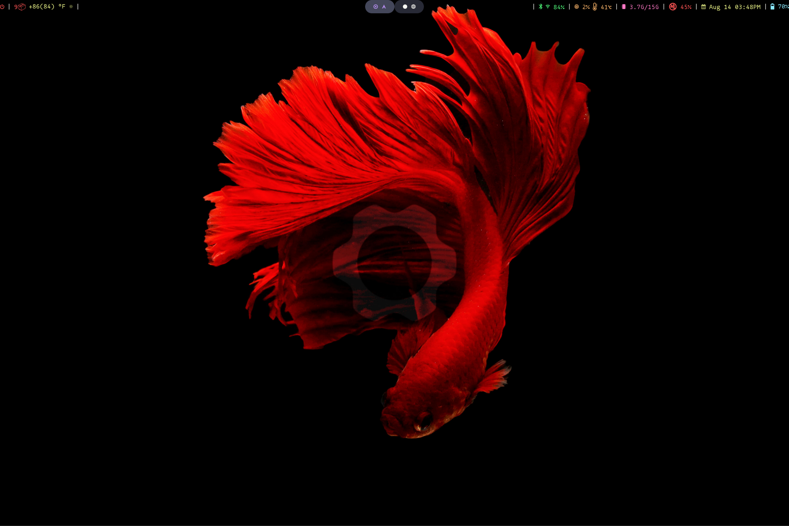

# Marty's Dotfiles

**Warning:** If you want to give these files a try, you should first modify them to fit your needs, and remove things you don’t want or need. Don’t blindly use online code unless you know what's in it and what it does. Use at your own risk! NO WARRANTIES/NO REFUNDS!!!

Otherwise these are pretty basic configs with nothing special. Lots of older configs for things like [qtile](http://www.qtile.org), [i3](https://i3wm.org/docs/), [conky](<https://en.wikipedia.org/wiki/Conky_(software)>), and others just look through .config

## Details

Current setup is running [Hyprland](https://hyprland.org/) and [Sway](https://swaywm.org/) as a backup with [eww](https://elkowar.github.io/eww/eww.html) & [Waybar](https://github.com/Alexays/Waybar) as another backup and [rofi](https://github.com/davatorium/rofi) (The wayland fork) application launcher (trying to go full wayland)

#### Keybound Apps

|          Name          |           Description            |
| :--------------------: | :------------------------------: |
|        `gedit`         |           `Super + a`            |
|         `nemo`         |           `Super + e`            |
|        `brave`         |           `Super + b`            |
|        `rofi`        |    `Super + d` = applications    |
|    `grim` & `slurp`    | Print Screen key for screenshots |
| `nm-connection-editor` |       click Network Widget       |

#### Fonts

|         Name          |              Description               |
| :-------------------: | :------------------------------------: |
|      `mononoki`       | Used for bar installed with nerd-fonts |
|      `Hack`           |          for everything else           |
| `nerd-fonts-complete` |           from AUR for icons           |

#### Bash & ZSH alias's

|       Name        |                   Description                    |
| :---------------: | :----------------------------------------------: |
|       `exa`       |                 `ls` replacement                 |
|     `pacman`      |               Arch package manager               |
|      `paru`       |             Arch AUR package manager             |
|    `reflector`    |             Updates mirrors on Arch              |
|   `youtube-dl`    | Download youtube videos/audio with `ytv` & `yta` |
|    `starship`     |           Changes the terminal prompt            |
| Compression Tools | `ex filename.ext` extracts most compressed files |

# Screenshots

### Sway

### Qtile

### i3/i3blocks bar

### Extras/Menus

## Thanks to/Inspirational Sources

- Reddit [u/emanuelep57](https://www.reddit.com/user/emanuelep57) for help with the volume widget on the qtile config & [u/FrostCastor](https://www.reddit.com/user/FrostCastor) for help with the battery indicator code
- [Distro Tube](https://distro.tube/) and his [dotfiles](https://gitlab.com/dwt1/dotfiles)
- And of course [Dracula Theme](https://github.com/dracula/dracula-theme) since I tend to use it on everthing I possibly can.
