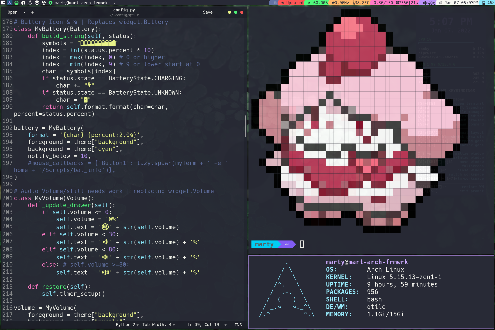
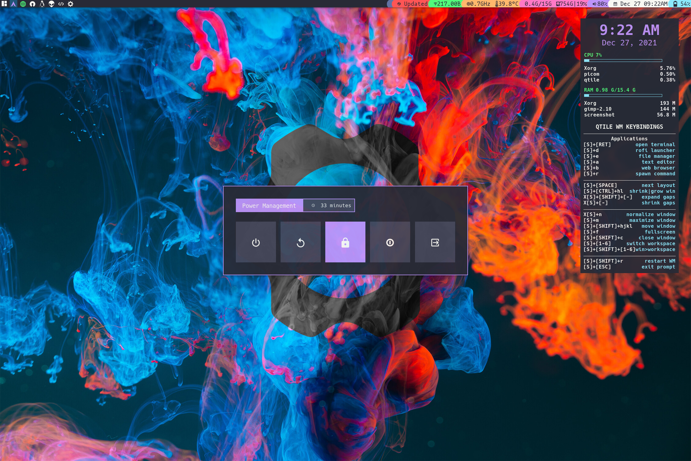
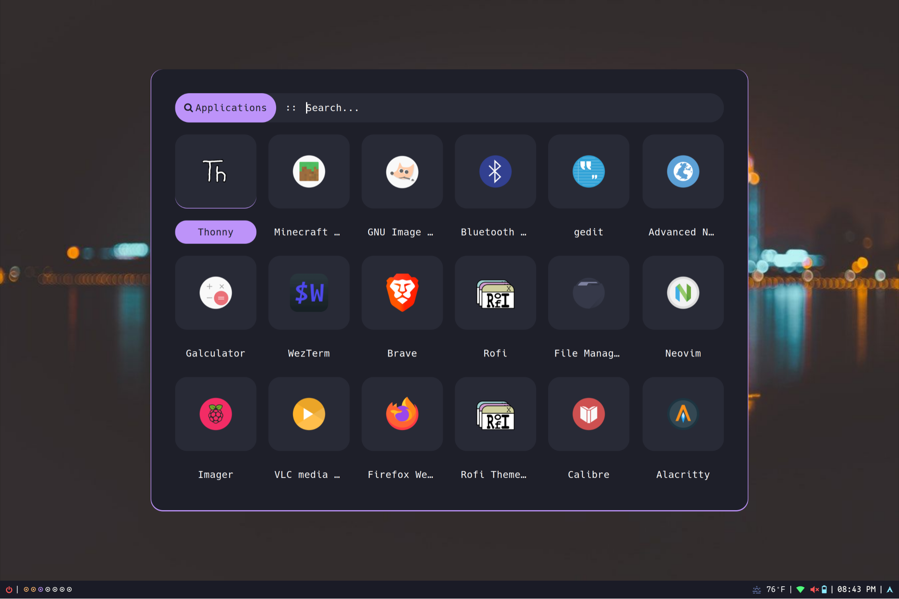

# Marty's Dots
**Warning:** If you want to give these files a try, you should first read them to verify it'll fit your needs, review the code, and remove things you don’t want or need. Don’t blindly use my settings unless you know what that entails. Use at your own risk! NO WARRANTIES/NO REFUNDS!!!

Otherwise these are pretty basic configs with nothing special.

## Details
* WM: qtile
* Colors/Themes: Dracula
* Terminal: Alacritty

## Dependencies
Trying to reduce the dependencies the best I can but as of now they are:

|Dependency|Description|
|:----------:|:-------------:|
|`qtile`|Window manager|
|`feh`|Fast image viewer used as wallpaper setting utility|
|`picom`|Window compositor.|
|`rofi`|Application launcher & Exit menu|
|`conky`|Auto launches and shows most keybindings(not always correct)|

## Optional Dependencies
These are just what I have setting
+ 'lightdm': Used for the 'dm-tools' to lock the computer
+ 'acpi': used for the battery management
+ 'bluez', 'bluez-utils', & 'blueman': All your bluetooth needs
+ 'scrot': for screenshots. Saves in ~/Pictures/Screenshots by default
+ 'alsa-utils': Kernel sound drivers
+ 'xbacklight' : Controls display brightness
+ 'mononoki & hack' : fonts.
+ 'redshift' : helps with limiting blue light at night

## Thanks to/Original Sources...
* [Distro Tube](https://distro.tube/) and his [dotfiles](https://gitlab.com/dwt1/dotfiles)
* And of course [Dracula Theme](https://github.com/dracula/dracula-theme) since I tend to use it on everthing I possibly can.
